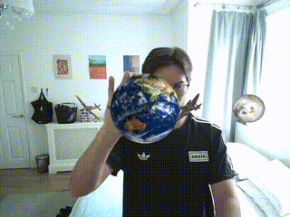

# SpinningEarthAR

This is an augmented reality (AR) application that combines real-time hand tracking with 3D rendering. The project uses OpenCV for hand detection, OpenGL for rendering, and GLFW for window management. It features a spinning Earth model, four orbiting Spitfire planes, and a moon, with interactive controls and AR integration. The hand detection model was trained in Python using YOLOv11n/s. See here: https://github.com/Michael-Millard/MillHandDetector. I exported the trained YOLO models in ONNX format and read them here in using OpenCV::dnn.

<div align="center">
  
</div>

## Features

- **3D Rendering**:
  - Realistic Earth model with spinning animation.
  - Four Spitfire planes orbiting the Earth, spaced 120 degrees apart, with independently spinning propellers.
  - A moon orbiting the Earth with realistic orientation, ensuring the same side always faces the Earth.
  - Customizable textures and shaders for enhanced visuals.

- **Hand Tracking**:
  - Real-time detection of hand position using OpenCV.
  - Smoothing algorithms to reduce jitter in hand tracking.
  - Depth estimation based on the size of the detected hand region.

- **AR Integration**:
  - Webcam or video feed as the background.
  - 3D models rendered in front of the live feed.
  - Models can be translated to follow the detected hand position.

- **Customizable Settings**:
  - Adjustable screen resolution, camera speed, and mouse sensitivity.
  - Configurable model paths, scales, and animation speeds.
  - Command-line interface for setting options and loading configurations.

- **Performance Optimizations**:
  - Efficient use of OpenGL for rendering.
  - Non-maximum suppression (NMS) for filtering hand detection results.
  - Multi-threaded build support with CMake.

## Requirements

To build and run SpinningEarthAR, ensure you have the following dependencies installed:

- **C++ Compiler**: A compiler that supports C++17 or later (e.g., GCC 7.3+, Clang 6.0+, MSVC 2017+).
- **CMake**: Version 3.14 or higher.
- **OpenCV**: Version 4.X, built with the DNN module enabled.
- **OpenGL**: A graphics card and driver that support OpenGL 3.3 or higher.
- **GLFW**: For window and input management.
- **GLAD**: For loading OpenGL function pointers.
- **YAML-CPP**: For parsing configuration files in YAML format.
- **ONNX Hand Detection Model**: Pre-trained YOLOv11n or YOLOv11s model in ONNX format.
- **glm**: OpenGL Mathematics library for matrix and vector operations.

### Optional Tools
- **CUDA**: For GPU acceleration of hand detection (if supported by your hardware).
- **v4l-utils**: For listing and managing video devices on Linux.

Ensure all dependencies are properly installed and configured before building the project. Refer to the build instructions below for more details.

## Usage

### Command-Line Options
Run the application with the following options:

```bash
./MillSpinningGlobe [options]
```

The defaults in config.yaml are pretty good. You shouldn't need to modify parameters much, just paths.

#### Available Options:
- `--webcam_name <string>`: Name of the webcam (default: Webcam).
- `--device_name <string>`: Device name (default: /dev/video0).
- `--screen_width <int>`: Screen width (default: 640).
- `--screen_height <int>`: Screen height (default: 480).
- `--fps <int>`: Frames per second (default: 60).
- `--onnx_model_path <string>`: Path to ONNX model (default: models/yolo11s_hand.onnx).
- `--onnx_input_size <int>`: ONNX model input size (default: 640).
- `--apply_smoothing <bool>`: Apply smoothing to hand tracking (default: true).
- `--camera_speed <float>`: Camera movement speed (default: 1.0).
- `--mouse_sensitivity <float>`: Mouse sensitivity (default: 0.1).
- `--camera_zoom <float>`: Camera zoom level (default: 45.0).
- `--init_position <float,float,float>`: Initial camera position (default: 0.0,0.0,3.0).
- `--earth_model_path <string>`: Path to Earth model (default: models/earth.obj).
- `--earth_scale <float>`: Scale of the Earth model (default: 1.0).
- `--spitfire_model_path <string>`: Path to Spitfire model (default: models/spitfire.obj).
- `--spitfire_orbit_radius <float>`: Orbit radius of Spitfire (default: 5.0).
- `--spitfire_orbit_speed_deg <float>`: Orbit speed of Spitfire in degrees per second (default: 30.0).
- `--spitfire_scale <float>`: Scale of the Spitfire model (default: 0.5).
- `--propeller_rps <float>`: Rotations per second of the propeller (default: 10.0).
- `--propeller_axis <float,float,float>`: Axis of propeller rotation (default: 0.0,1.0,0.0).
- `--config_path <string>`: Path to configuration file (default: config/config.yaml).
- `-h, --help`: Show help message and exit.

## Build Instructions

1. Clone the repository:
   ```bash
   git clone https://github.com/Michael-Millard/SpinningEarthAR.git
   cd SpinningEarthAR
   ```

2. Create a build directory and configure the project:
   ```bash
   mkdir build && cd build
   cmake ..
   ```

3. Build the project:
   ```bash
   cmake --build . -j
   ```

4. Run the application:
   ```bash
   ./MillSpinningGlobe
   ```

# Acknowledgements
1. Thanks to Ringo3D for the Earth 3D model: https://www.turbosquid.com/3d-models/earth-max-free/1016431
2. Thanks to sscott2031 for the Spitfire 3D model: https://sketchfab.com/3d-models/spitfire-mk-ixe-08b356e7297b4e83bd1524c10bb05cad
3. Thanks to Chenchanchong for the Moon 3D model: https://skfb.ly/pzJGt (licensed under Creative Commons Attribution: http://creativecommons.org/licenses/by/4.0/).
4. Thanks to Nouman Ahsan for the Hand Detection dataset on which my YOLO models were trained: https://www.kaggle.com/datasets/nomihsa965/hand-detection-dataset-vocyolo-format?resource=download
5. Thanks to Ultralytics for the YOLOv11 nano and small models.
